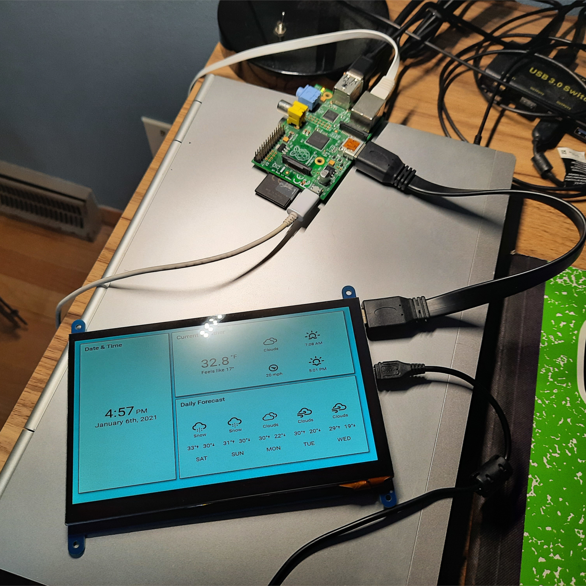
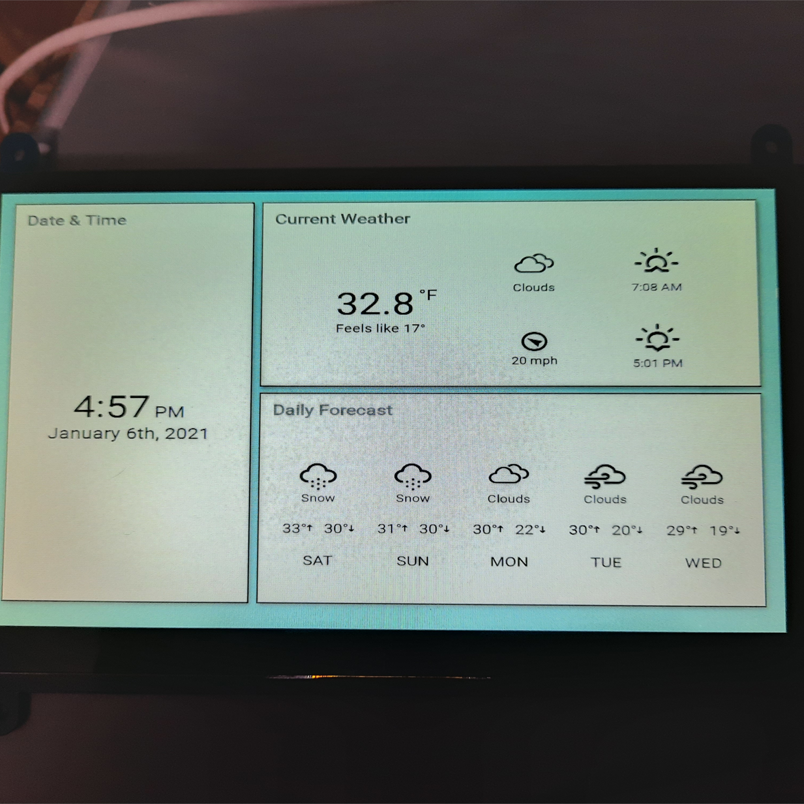

# pi-dash

A desktop dashboard that runs on a Raspberry Pi Model B and a small touchscreen display. The dashboard itself is a web app built with F# and Fable/Elmish.

To run the application you must first create a `dist/config.json` file and configure the app. The `sample_config.json` file can be used as a template. Once the application is configured, run `npm install` to install the dependencies, and then `npm start` to make it available on `http://localhost:8080`.

